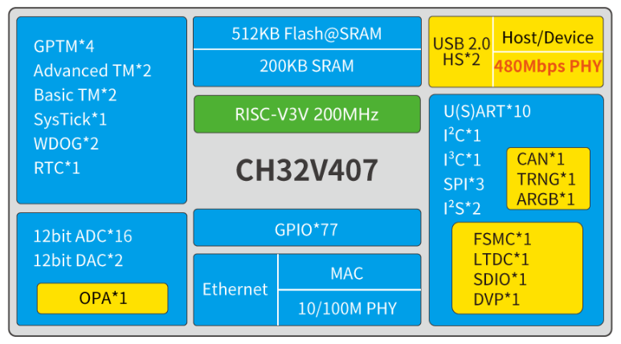

# RISC-V内核工业级互联型微控制器 CH32V407_V467

[EN](README.md) | 中文

### 概述

CH32V407是基于青稞RISC-V内核设计的工业级互联型微控制器，支持200MHz主频零等待运行，支持V 向量指令集，用于加速计算或并行处理等应用。CH32V407 内置2 组USB 2.0 高速PHY 收发器
（480Mbps）、以太网MAC控制器及10/100兆物理层收发器；内置双ADC单元、双DAC单元、OPA运放等模拟资源；提供了2 组共24 路DMA 控制器、SDIO、DVP 数字图像接口、RNG、ARGB、LTDC、FSMC、
多组定时器、10组USART串口、I2C接口、I3C接口、3组SPI、2组I2S、CAN接口等丰富外设资源。CH32V467在CH32V407的基础上增加了4M或8M字节的片内扩展PSRAM存储器，支持DMA。

### 系统框图

### 产品特点

- 青稞32位RISC-V3V内核，多种指令集组合
- 支持V向量指令集，支持并行计算
- 快速可编程中断控制器+硬件中断堆栈
- 2级中断嵌套
- 系统主频高达200MHz

- 200KB零等待易失数据存储区SRAM
- 992KB程序存储区CodeFlash
（零等待应用区+非零等待数据区）
- 28KB系统引导程序存储区BootLoader
- 128B用户自定义信息存储区

- 8MB扩展PSRAM存储器(仅CH32V467)
- DMA块读/块写速度可达800Mbytes/s

- 系统供电VDD电压范围：2.9～3.6V
- 低功耗模式：睡眠、停止、待机
- VBAT电源独立为RTC和后备寄存器供电

- 内置出厂调校的20MHz的RC振荡器
- 内置约40kHz的RC振荡器
- 高速振荡器支持外部5～32MHz晶体
- 低速振荡器支持外部32.768kHz晶体
- 上电/下电复位、可编程电压监测器
- 实时时钟RTC：32位独立定时器

- 2组12位数模转换DAC

- 2组12位模数转换ADC：
- 模拟输入范围：VSSA～VDDA
- 16路外部信号+2路内部信号通道
- 双ADC转换模式

- 运放OPA/PGA/电压比较器：
- 各2路输入通道及输出通道

- 2组共24路通用DMA控制器

- 10组USART串口：支持LIN

- I2C接口（支持SMBus/PMBus）

- I3C接口

- 3组SPI接口（SPI2、SPI3用于I2S2、I2S3）

- 2组480Mbps高速USB 2.0控制器及PHY：
- 支持高速/全速的Host和Device模式
- 支持1024字节数据包

- CAN接口（2.0B主动）

- SDIO接口（MMC、SD/SDIO卡及CE-ATA）

- FSMC存储器接口

- 150MHz数字图像接口DVP

- LCD-TFT显示控制器LTDC

- 随机数发生器RNG

- 可寻址RGB（ARGB）

- 百兆以太网控制器MAC及10M/100M PHY
- MAC和PHY全集成，外围只需要电容
- 支持Auto-MDIX线路自动转换和极性自适应
- 10M/100Mbps自动协商，支持全双工和半双工

- 多组定时器：
- 2个16位高级定时器，支持死区控制和紧急
  刹车，提供用于电机控制的PWM互补输出
- 4个16位通用定时器，提供输入捕获/输出比
  较/PWM/脉冲计数及增量编码器输入
- 2个基本定时器
- 2个看门狗定时器（独立和窗口型）
- 系统时基定时器：32位计数器

- 快速GPIO端口：
- 77个I/O口，映射16个外部中断

- 安全特性：CRC计算单元，96位芯片唯一ID

- 单线或双线调试模式

- 封装形式：LQFP、QFN
